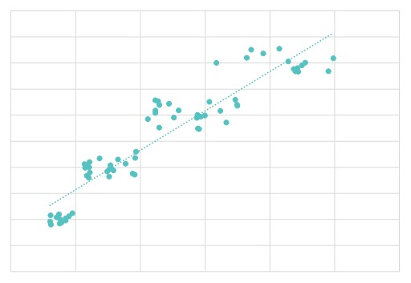
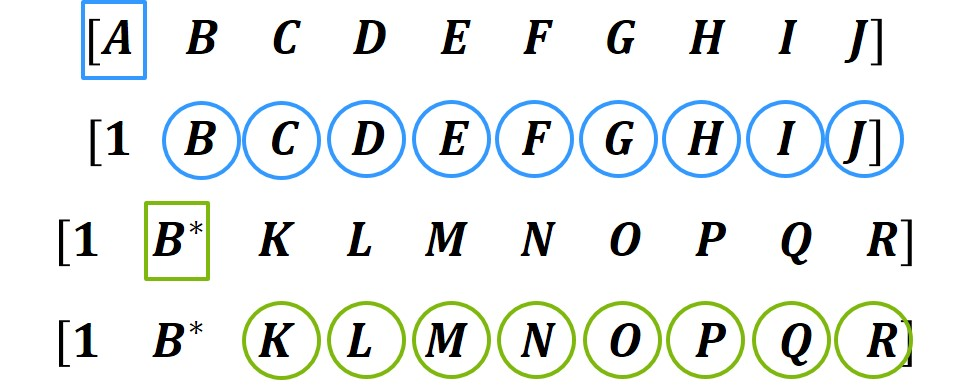
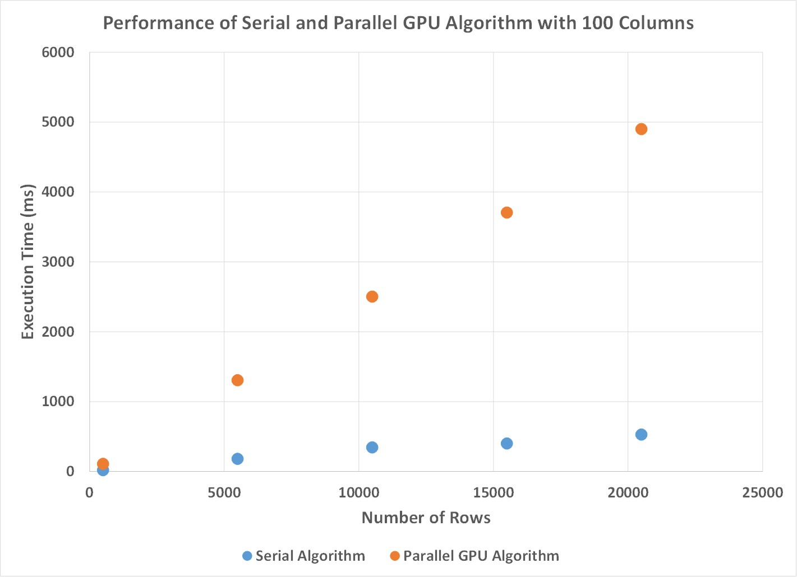
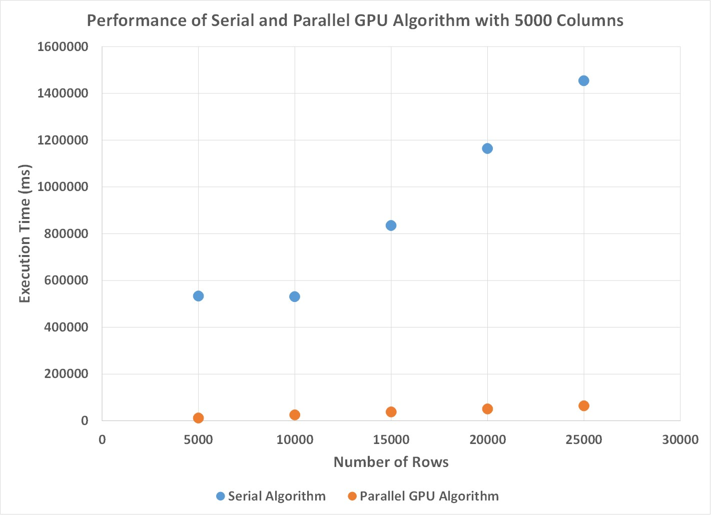

# Project Summary

The LSQ best subset regression algorithm can be used to identify accuracte linear models with a small number of variables. 
The performance of this algorithm is dominated by the cost of performing one inherently sequential kernel repeatedly. 
It is possible to parallelize this algorithm to be suitable for GPU computing by eliminating dependencies by repeating certain calculations. 
I implemented a GPU parallel least squares algorithm based off of Alan Miller's designed for Fortran 90 [1]. 
I compared the performance of a GPU parallel algorithm at solving best subset regression problems against a C++ copy of the original implementation. 
Experiments were conducted on a workstation with two Intel Xeon processors E5-2660 v3 at 2.6 GHz and 128 GB of RAM, and a Nvidia Tesla K40 GPU.
The GPU implementation was able to achieve a 25x speedup compared to the original implementation for larger sized problems. 

# Background

Unconstrained linear least squares is used to develop linear models from data.
Given a set of data that relates input variables to some measurable output, the output from a linear least squares problem is a linear model that relates input to output data.
There are many ways to solve the linear least squares problem that trade-off computational complexity for numerical accuracy. 
In particular, I am interested in solving linear least squares problems for solving the best subset regression problem. 
Best subset regression is a method used to determine the most accurate model given a large set of data.
When generating a linear model, not all measured variables may have a direct impact on the value of some dependent variable. 
In those cases, the best subset regression problem attempts to find the best subset of variables that can be used to predict an output response [2].

In the LSQ algorithm that I parallelized, the part that is computationaly expensive and could benefit from parallelization was the column updates.
This algorithm iteratively reads in a row of data and updates a QR factorization.
The most time consuming operation is reading in a new row of data and updating the QR factorization result for each row.
This is the most computationally intense part because for every value in every row, the algorithm performs a few operations and then has to update the remaining values in that row.
Fortunately, these updates are independent of each other in each row and can be executed in parallel.

The algorithm is filled with a lot of sequential dependencies. 
One of the most apparent is that each row has to be read in sequentially. 
This dependency requires that only one row can be read in at a time, otherwise the solution would be incorrect.
Additionally, this algorithm has to iterate through every value in a row, but this operation can not begin until the previous iteration's update operation has at least finished the update on the next value. 
These restrictions severely limit how much parallelism can be found in this code, by eliminating the possibilty of reading in multiple rows at the same time, as well as running different column updates simultaneously. 
As mentioned before, there is still some parallelism in this algorithm by executing multiple column updates simultaneously, so the parallelism is directly related to how many columns are in the matrix. 
This parallelism is amenable to SIMD execution because the same series of operations are performed on different data, which is one of the reasons why I chose to use GPU computing for this application.

# Approach

In this algorithm I used both C++ and CUDA. 
I targeted my algorithm to work on an Nvidia Tesla K40 GPU. 
Otherwise the baseline algorithm was initially developed in Fortran, but I converted it to C++ to compare against the performance of the GPU algorithm.

To utilize the parallel processing power of a GPU, I had to map my matrix to thread blocks and threads on the GPU.
Initially, I had tried to utilize multiple thread blocks to use as much of the GPU as I could.
However, I quickly realized that I had an accuracy issue because I was not able to ensure that all updates on one thread block would be observed by another thread block before beginning a new iteration. 
To get around this problem, I decided to settle for using one thread block so that I could use the __syncthreads() command to ensure that I did not violate any sequential dependencies inherent to the algorithm. 
After testing, I then found that the optimal way to map values from my matrix to threads on the GPU was to use a thread block that had 1 row and 512 columns. 
With this method, I was able to map a row to the thread block so that warps would be able to access contiguous values.
For matrices that had more than 512 columns, I would have each thread operate on values i, i+512, i+1024, and so on until the end of that row. 
This way I was able to map values in each column to a thread, I was able to have warps access contiguous values from memory, and because I was only using one thread block, I was able to store all of my values in shared memory so that they could be quickly accessed. 

To enable a better mapping to the GPU architecture, I did change the original algorithm slightly so that it would be more amenable to parallel computing. 
In the original algorithm, a few operations were carried out on the value that was currently being operated on, and then the rest of the values in that row were sequentially updated.
At this point, I had two thoughts, I could either allow one thread to perform those operations, and have the other 511 threads remain idle, or I could have all 512 threads perform the same computations and immediately begin performing their update operations.
After some testing and thinking, I decided to have each of the threads replicate a few of the operations on the current value, and then perform their threads update operations.
I decided to do this because after some experimenting where I added extra floating point operations and saw that it had very little effect on the computational performance, I realized that my algorithm was memory bound. 
Since we were bound by bandwidth, I decided that by performing a few more computations to reduce the amount of memory that needs to be transferred, and reduce the amount of time the threads are waiting to synchronize with each other would lead to a more efficient algorithm.

The piece of code that I started with was the LSQ.f90 algorithm by Alan Miller as mentioned above. 
This algorithm was sequential and I had to parallelize the includ() function as it was the most time consuming in the best subset regression process.
I chose to use a forward selection heuristic that was also implemented in another one of Alan Miller's fortran code to perform, however this part was not parallelized in my algorithm. 

## Optimization Iterations

Initially, my first approach was to try and parallelize how many rows were updating the factorization result in each iteration. 
I realized that there was a sequential dependency so that updates could not easily be performed in parallel and combined later to arrive at the same solution as the sequential code.
I first thought that if I repeated enough work I would be able to eliminate sequential dependencies. 
I tried to use two dimensional thread blocks where each row of threads was a row in my matrix, and the columns were the threads in each row. 
Then, to repeat work I had every row calculate the updated values, a few vectors of results, for each of the previous rows up to and including the threads current row.
This resulted in every thread row performing the exact same calculation so that all threads would see the same results and I would not have to synchronize between rows. 
I then set a block size parameter that I adjusted so that my thread block always had 512 threads and I varied it to identify an optimal block size for the problems that I tested.
I discovered that for almost every problem that I tested, using only 1 row of threads was optimal and instead to use 512 column threads. 
This result suggested to me that there was more benefit in parallelizing the update operations in each row as opposed to adding multiple rows to the factorization result. 

Another method that I attempted to map multiple thread blocks to each row. 
For matrices that have more columns than the number of threads that I could map to that row with one thread block would require the same thread to perform calculations on multiple pieces of data. 
So I attempted to map more threads to those rows so that each thread would only have to operate on updating one value and could keep those values in memory without having to load the values for another column as well.
To ensure that each thread had accurate values from the factorization before performing the update, I replicated the factorization operation onto every thread block so that every block would be able to immediately begin the update as soon as its factorization finished.
However, one issue I quickly discovered was that I would not easily be able to ensure that all of the updates in the previous iteration could be communicated to other thread blocks before the factorization on the next column began.
This issue could lead to inaccuracies because one thread could begin a factorization on an incorrect value which would lead to incorrect update operations on the rest of the values in that iteration.
To solve this issue, I settled for only using one thread block per row so that I could ensure that the next column factorization began after the previous iteration had completely finished.

After both of these attempts when I realized that mapping a single row to the one thread block I was using, and then iterating over all of the rows in the matrix, I was able to clean up my algorithm. 
I designed the algoritm so that it could handle matrices with any width and any height. 
I eliminated trying to update the factorization with multiple rows at once, and instead focused on performing updates after the factorization in parallel. 
I also made sure to structure conditional statements in my code so that all threads would reach points that required synchronization so that I could use syncthreads. 
This was a slight restructure from the sequential code that would return if certain conditions were met. 

# Results 

## Performance 

The goal of this project was to determine if a GPU parallel best subset regression algorithm could be developed to be faster than the sequential LSQ algorithm that I began with.
To determine how well the parallel algorithm performed, I compared execution time of the GPU algorithm against the execution time of the sequential algorithm.
From preliminary timing of the algorithm, the one function, includ, required over 95% of the execution time for all of the problems that I examined. 
So I decided to only compare the time required by both algorithms to perform the includ operation, and the rest of the operations were performed in the exact same manner for both algorithms and were not timed.
For this timing, this meant that I decided to exclude the amount of time required to transfer data to the GPU from the CPU before beginning calculations.
I decided this was a reasonable assumption because if I were to work on this algorithm more, I could port most of it to the GPU and could run the entire best subset regression operation on the GPU. 
This would allow me to lessen the effect of having to transfer data from the CPU to to the GPU and back by performing all of the operations on the GPU afterwards.
Additionally, I discovered that this time was about constant for most of the problems that I experimented with, and for larger problems even including this time would not have had a significant impact on the speedup obtained by the parallel algorithm.

## Experimental Setup

I ran all of my experiments on a workstation with two Intel Xeon processors E5-2660 v3 at 2.6 GHz and 128 GB of RAM, and a Nvidia Tesla K40 GPU.
The sequential code that I used was single threaded, and just a simple C++ translation of the Fortran code that the code originated in.
I conducted my experiments with randomly generated matrices that were well conditioned to test the performance of this algorithm. 
The matrices I experimented with spanned a wide range of sizes from smaller matrices that were 100 x 100 to larger matrices that were 25,000 x 5000 double precision elements. 
A large range of problem sizes were tested so that I could determine how this algorithm scales with problem size.
Initially, I compared matrices that had the same number of columns and only varied in the number of rows, and then I averaged speedups from matrices with the same number of columns to see how changing the number of columns effected performance.

My results were generated by timing how long the includ portion of the algorithm took to execute. 
I would read in a matrix store it and then have my sequential version run the includ algorithm, get an execution time, and then have the GPU algorithm operate on a copy of the data fed to the sequential algorithm.
Then I ran experiments for 5 or 6 different matrices of varying number of rows with the same number of columns, and I would obtain speedups for each one.
After running experiments for matrices of varying sizes, I averaged the speedups for each of the matrices of the same number of columns and then compared the results against each other. 
Across the experiments, the number of rows in each of the experiments was held about constant across experiments so that that did not have any impact on performance.

## Performance Plots

Initially, I examined how the two algorithms compared as I increased the number of rows, while holding the number of columns constant. 
As seen in the Figures below, what was observed was that as the number of rows increased, the execution time linearly increased as well.

 *This figure shows how the execution time of the sequential and parallel best subset regression algorithms change when the number of columns is held constant at 100.*

 *This figure shows how the execution time of the sequential and parallel best subset regression algorithms change when the number of columns is held constant at 5000.*

From these plots I observed two things.
First, for matrices with a low number of columns, the performance of the sequential algorithm was significantly better than the GPU implementation.
The reason for this was that the overhead of creating threads was outweighed by performing all of the operations on the CPU for skinny matrices. 
Since the parallelism I took advantage of was by updating values simultaneously in each row, for matrices with not that many columns there was not much opportunity to increase performance. 
However, for problems that had a large number of rows, the GPU algorithm performs 25x faster than the sequential algorithm.
In this case, the threads on the GPU are able to be filled with enough work per iteration that by performing operations in parallel significantly outweighs the cost of having to repeat some calculations and honor some sequential dependencies. 
Additionally, because I decided to use shared memory, and have threads access values in a coaleseced manner, the GPU warps are able to efficiently read in the values that are required and perform the required update operations efficiently. 

Instead of showing more plots that show linear increases as the number of rows increases, I also wanted to include a plot that compared the results as the number of columns changed.
What I observed was that as the number of columns increased, there was a quadratic increase in the speedup obtained by the GPU algorithm over the sequential algorithm.
This occurred for reasons previously mentioned that as the matrix width increased, each thread on the GPU was able to be more efficiently utilized and perform the nessecary calculations faster. 

## Speedup Limitations

In this algorithm the major limiting factor in performance were the sequential dependencies built in the algorithm.
From experimenting, I observed that for skinnier matrices, the parallel algorithm could be anywhere from 4 to 10 times slower than the sequential algorithm.
The calculations required in this implementation required that updates be performed after factorization took place on an element, and that we had to iterate through every row and every column element of the matrix.
Additionally, in a parallel setting we had to ensure that threads would not begin working on the next value until we could ensure that that value had been correctly updated from the previous update operations. 
So in this case we ended up being memory-bound having to wait for operations to complete, and communicated to memory before we could begin the next set of operations. 
I observed in my code that most of the threads would sit idle waiting for another thread to finish it's computation leading to an uneven distribution of work as well.

In the case of skinnier matrices, what limited my speedup was not being able to give much work to each thread.
Since each thread would only have a few calculations to perform every iteration, at the cost of having to perform extra calculations as well as the cost of initializing the thread, we saw that there was almost no benefit to using the parallel algorithm for skinny matrices. 
However, for wider matrices that could better utilize the threads and better utilize the GPU, we were able to obtain higher speedups. 

Even though, I had thought that updating multiple rows simultaneously could lead to better performance, what I observed was that by repeating the work, I could have less threads perform column updates which led to a worse performance.
For example, when I updated 16 rows at the same time, I noticed that my code took about 4 times as long than when I had only updated 1 row with the final implementation I decided to use for a few different problems. 
Losing out on a whole axis of parallelism that I had expected to be able to use effected how much speedup that I believe could have been achieved for skinnier matrices, even though wide matrices were able to be sped up fairly well. 

## Algorithm Breakdown

If I were to divide my algorithm into different chunks to compare their execution time, I could divide the algorithm into a few phases.
The first phase is loading values into shared memory for each row, which requires a very small portion of the execution time. 
Next, every thread performs the factorization operations on a value before each thread updates the value in its respective column.
Each of these operations only requires a few floating point operations, but the update operation is more expensive because it requires multiple memory reads and writes to global memory. 
The updates are such that each thread reads and writes to a different value in global memory so that those operations can be performed in parallel, but it is still the most expensive part of the code. 
The final part is updating values to global memory after all of the updates have taken place.
Even though each of these phases independently is fairly short, the issue in this algorithm is that each of those is that the factorization and updates are repeated for every value in the matrix. 
The room to improve in this context could be to do some type of blocking factorizations so that I could perform multiple factorizations at the same time, and perform group updates on the rest of the values in the row.
I did not attempt that modification yet as it would require a fundamentally different algorithm that I did not have time to figure out the details of how exactly that would work, even before I have to implement it. 

Finally, I believe that my choice of machine target was correct.
I believe that a GPU was the correct choice for this algorithm as it was able to perform hundreds of update operations simultaneously, something that only a supercomputer would be able to do. 
While it is possible that some of the more irregular computations could have been performed faster on a CPU, how GPU threads are set up, and how they were able to process all of the data seemed more beneficial for this algorithm. 
The only issue I had with using a GPU was that I was not able to better synchronize between thread blocks, but I believe that if I had more time I could come up with a better solution that would still be accurate and could better utilize the processing power of the GPU to achieve better speedups for some problems. 

# References

[1] A. Miller. LSQ.f90, Current as of 10, April, 2017. jblevins.org/mirror/amiller/.

[2] http://support.minitab.com/en-us/minitab/17/topic-library/modeling-statistics/regression-and-correlation/basics/basics-of-best-subsets-regression/

## Please use the links above to access the project [Proposal](https://bsauk.github.io/GPU_LSQ/proposal) and [Checkpoint](https://bsauk.github.io/GPU_LSQ/checkpoint) reports.